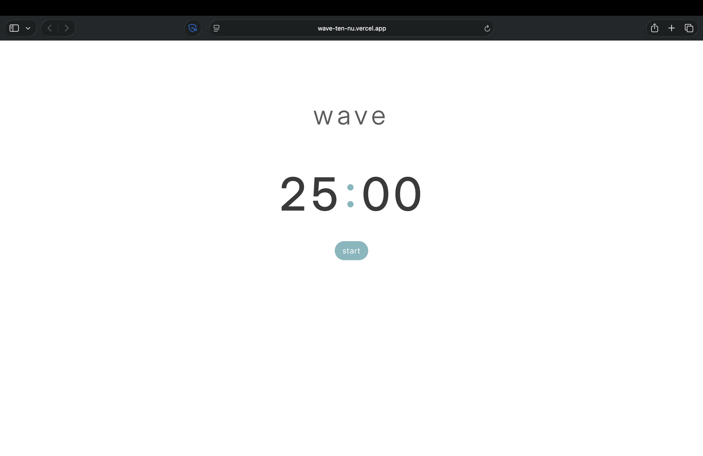
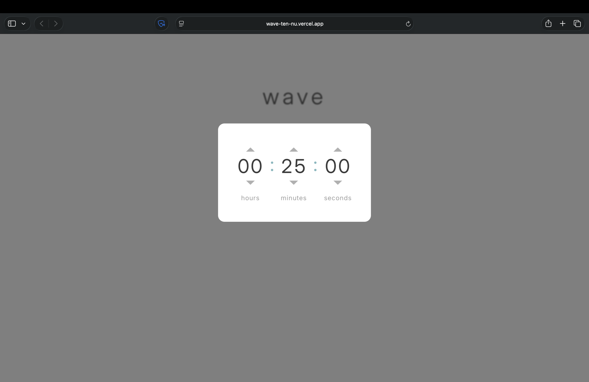

# Wave (WIP)

A minimal study/focus timer inspired by calming ocean waves. Developed with React, Typescript and CSS.

## Live Demo

https://wave-ten-nu.vercel.app/

## Preview





## Core Features (v1)

- Countdown timer
- Settings
- Local storage persistence
- Clean and minimal styling

## Motivation

Many existing productivity tools are either cluttered and overwhelming or visually uninspiring. Wave was created to be minimal and not distracting with thought put into visuals and aesthetics, creating a pleasant focus experience.

This project is also for me to explore:

- Product thinking
- UI/UX design
- Front-end development

## Tech Stack

- React
- Typescript
- CSS

## Getting Started

```bash
# Clone the repo
git clone https://github.com/lukaritri/wave.git

# Install dependencies
npm install

# Run locally
npm run dev
```

## Status

This project is a WIP. Currently, the core timer functionality has been implemented with simple UI.

## Currently Working On

- [x] Timer settings
- [ ] Simple wave animation
- [x] Local storage persistence
- [x] Deployment

## Future Ideas

- Break/pomodoro mode
- Ocean wave ambient sounds
- Dynamic and reactive wave animation

## Notes

This project is a work in progress and part of my continued learning in modern frontend development.
